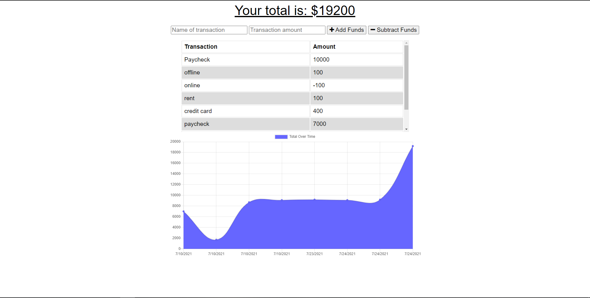

# Budget-Tracker-App
## Table of Contents
-[Description](#description)

-[Installation](#installation)

-[Usage](#usage)

-[Contributions](#contributions)

-[Tests](#tests)

-[License](#license)

-[Questions](#questions)

## Description
This application helps the user to keep track of their funds, add or substract, it is Progressive Web App and works on and offline.
Please follow [link to deployed application](https://still-headland-45403.herokuapp.com/).

## Installation
Install the node modules, and run the application.
## Usage
Type the name of the transaction, and the ammount of the transaction. Then select if you're going to add or substract the funds. After that you will get a chart with your transactions.
## Contributions
Contributions are open for this project, clone the repo and add your code.
## Tests
No tests were created for this project.
## License
The MIT License
## Questions
If you have questions about this project pleas contact me:
GitHub: https://github.com/00anp/
E-mail: alfonso.nunez29@gmail.com